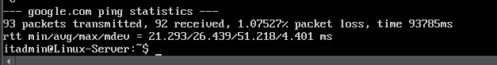
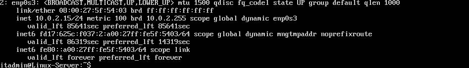
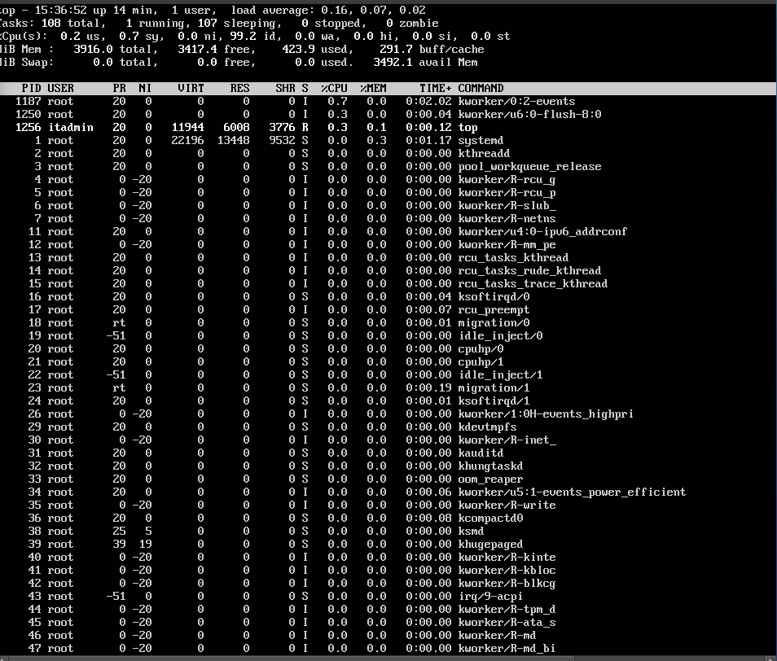
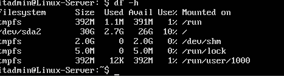

# IT Support Home Lab

## Project Overview

This project simulates common IT support troubleshooting tasks using a virtual Linux server environment.

The lab demonstrates how system administrators diagnose network connectivity issues, monitor system performance, and analyze disk usage using Linux command line tools.

The environment was built using VirtualBox and Ubuntu Server to replicate real-world IT support scenarios.

---

## Technologies Used

• VirtualBox  
• Ubuntu Server  
• Linux Command Line  
• Network Diagnostics  

---

## Skills Demonstrated

• Linux system administration  
• Network troubleshooting  
• Command line diagnostics  
• System performance monitoring  
• Disk storage analysis  
• IT incident troubleshooting  

---

## Troubleshooting Demonstrations

### Network Connectivity Test

Command used:

```
ping google.com
```

Purpose:
Verify external network connectivity and confirm DNS resolution.

Result:



---

### IP Address Identification

Command used:

```
ip a
```

Purpose:
Identify the network interface and assigned IP address.

Result:



---

### System Monitoring

Command used:

```
top
```

Purpose:
Monitor CPU usage, memory usage, and active processes.

Result:



---

### Disk Usage Analysis

Command used:

```
df -h
```

Purpose:
Check system storage allocation and available disk space.

Result:


